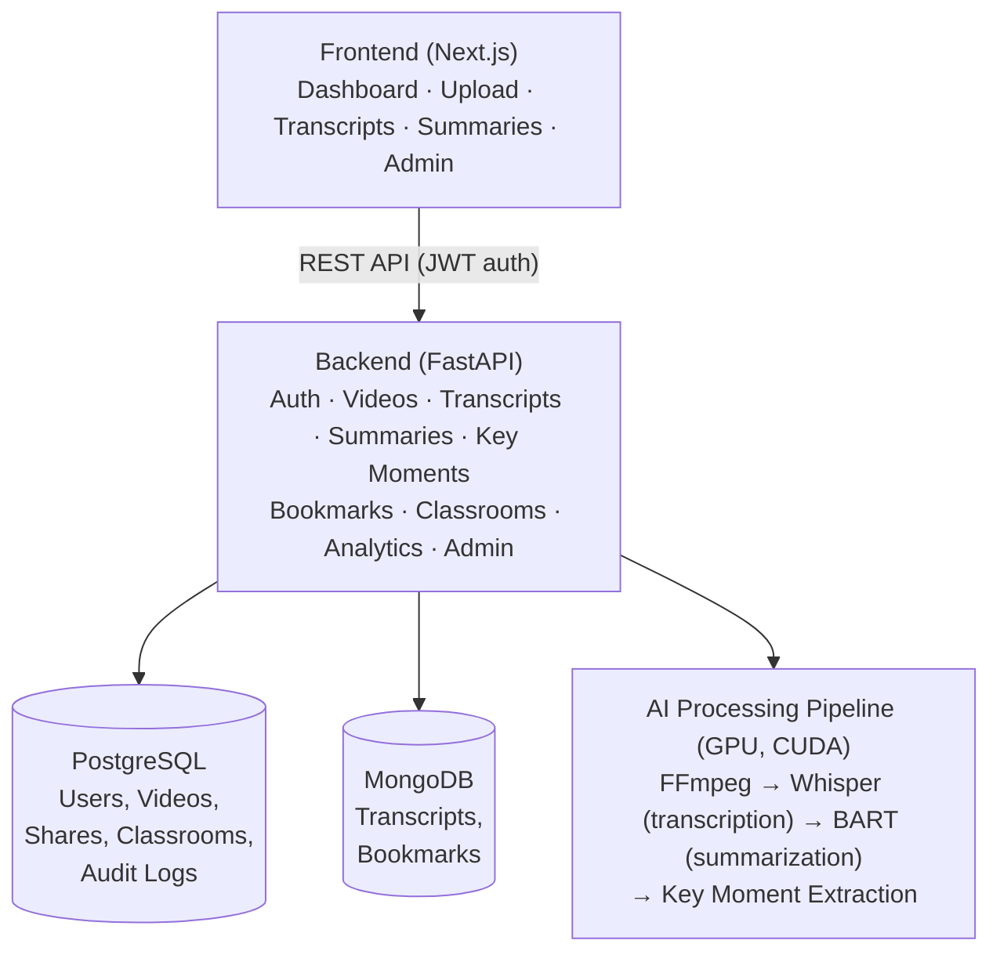

# ClipMind AI

**AI-Powered Video Summarization & Key Moments Detection Platform**

ClipMind AI automatically transcribes, summarizes, and extracts key moments from uploaded videos using local, GPU-accelerated AI models. Built as an end-to-end platform for content creators, learners, educators, and administrators to consume and manage long-form video content efficiently.

---

## Table of Contents

- [Overview](#overview)
- [Key Features](#key-features)
- [User Roles](#user-roles)
- [Tech Stack](#tech-stack)
- [Architecture](#architecture)
- [Project Structure](#project-structure)
- [Getting Started (Docker)](#getting-started-docker)
- [Deployment](#deployment)
- [Environment Variables](#environment-variables)
- [Running Tests](#running-tests)
- [API Overview](#api-overview)
- [Milestone Progress](#milestone-progress)
- [Manual Testing](#manual-testing)
- [License](#license)

---

## Overview

ClipMind AI takes a raw video upload and turns it into:

- A full **transcript** (speech-to-text)
- A **short and detailed AI-generated summary**
- **Key moments / highlights** with timestamps
- **Analytics** on content and platform usage

The platform supports role-based access, video sharing (private/shared/public), classrooms for educators, bookmarking, password recovery, and an admin console for platform oversight.

## Key Features

- JWT-based authentication with refresh tokens and role-based access control (RBAC)
- Video upload with format standardization, thumbnail and audio extraction (ffmpeg)
- GPU-accelerated speech-to-text transcription (Whisper, CUDA)
- AI-powered summarization (BART) with short and detailed summary modes
- Key moments / highlight detection with timestamp extraction
- Transcript search with match highlighting, and inline transcript editing
- Bookmarks (videos, summaries, key moments) backed by MongoDB
- Three-tier video sharing: Private / Shared (per-email) / Public
- Classrooms for educators with rosters and per-classroom analytics
- Forgot/reset password flow via stateless JWT tokens and email (SMTP, console fallback in dev)
- Analytics dashboard: watch time, engagement, content insights, usage stats
- Admin module: user & role management, content moderation, platform stats, audit logs
- Dark mode UI, icon-only collapsible sidebar, dynamic breadcrumb navigation
- Fully containerized with Docker Compose, including GPU passthrough

## User Roles

| Role | Purpose |
|---|---|
| **Content Creator** | Upload videos, generate transcripts/summaries/key moments, view analytics |
| **Learner** | Watch videos, read summaries, search transcripts, bookmark content |
| **Educator** | Upload lecture videos, manage classrooms, share content with students, track engagement |
| **Administrator** | Manage users/roles, moderate content, view platform-wide analytics and audit logs |

## Tech Stack

**Backend:** Python, FastAPI, SQLAlchemy, Alembic
**Frontend:** React.js / Next.js, Tailwind CSS
**Databases:** PostgreSQL (relational data), MongoDB (transcripts, bookmarks)
**AI/ML:** OpenAI Whisper (speech-to-text), Hugging Face Transformers, BART (summarization), PyTorch (CUDA 12.4)
**Video Processing:** FFmpeg
**Auth:** JWT (python-jose), bcrypt/passlib
**Testing:** Pytest, pytest-asyncio
**DevOps:** Docker, Docker Compose, GPU passthrough via NVIDIA Container Toolkit

## Architecture



## Project Structure

```
ClipMindAI/
├── backend/
│   ├── app/
│   │   ├── api/v1/          # Route modules (auth, videos, transcripts, ...)
│   │   ├── core/            # Config, security, dependencies
│   │   ├── models/          # SQLAlchemy models
│   │   ├── schemas/         # Pydantic schemas
│   │   ├── services/        # AI pipeline, business logic
│   │   └── main.py
│   ├── tests/                # Pytest suite (150+ tests)
│   ├── storage/uploads/       # Uploaded video storage (bind mount)
│   ├── Dockerfile
│   ├── requirements.txt
│   └── .env.example
├── frontend/
│   ├── app/                  # Next.js app router pages
│   ├── components/           # UI, video, landing components
│   ├── lib/                  # Auth context, theme context, API client
│   └── Dockerfile
├── docker-compose.yml
├── .env.example               # Root env — single source of truth for Compose
├── DOCKER_SETUP.md
└── LICENSE
```

## Getting Started (Docker)

### Prerequisites

- Docker Desktop (Windows/Mac) with WSL2 backend, or Docker Engine (Linux)
- NVIDIA GPU + NVIDIA Container Toolkit, for GPU-accelerated transcription
- ~10GB free disk space for model weights (Whisper, BART) on first run

### Setup

1. Clone the repository and check out the `danyaal` branch:
   ```bash
   git clone https://github.com/springboardmentor3010s/Clip-Mind-AI.git
   cd Clip-Mind-AI
   git checkout danyaal
   ```

2. Copy the root environment template and fill in real values:
   ```bash
   cp .env.example .env
   ```
   At minimum, set `POSTGRES_USER`, `POSTGRES_PASSWORD`, `POSTGRES_DB`, `MONGO_DB_NAME`, and `JWT_SECRET_KEY`.

3. Build and start all services:
   ```bash
   docker compose up --build
   ```
   First run will download Whisper and BART model weights into cached volumes — this can take several minutes.

4. Verify everything resolved correctly before relying on it:
   ```bash
   docker compose config
   ```

### Access

| Service | URL |
|---|---|
| Frontend | http://localhost:3000 |
| Backend API | http://localhost:8000 |
| Postgres (host) | localhost:5433 → container port 5432 |
| MongoDB | localhost:27017 |

> Postgres is mapped to host port **5433** (not 5432) to avoid conflicts with a native Windows Postgres install. Internally, the backend still connects to `postgres:5432` inside the Docker network.

### Tearing Down

```bash
docker compose down -v          # stop containers, remove volumes (wipes DB data)
docker compose down --rmi all   # also remove built images
```

## Deployment

The platform is fully containerized and deployment-ready. For live demos, the Dockerized stack is exposed publicly via **Cloudflare Tunnel**, giving reviewers a real HTTPS URL to the running frontend and backend without any cloud infrastructure setup.

```bash
cloudflared tunnel --url http://localhost:3000
```

This approach was chosen deliberately over a first-time GPU cloud VM setup (AWS/Azure) to avoid deployment risk during evaluation — GPU cloud instances require quota approval, driver/CUDA setup, and image rebuilds, none of which are necessary when the existing Docker Compose stack already runs correctly with GPU passthrough.

## Environment Variables

Docker Compose reads variable substitution from a single `.env` file at the **project root** — not from `backend/.env` (used only for local, non-Docker development) and not from `.env.example` (a placeholder template, safe to commit).

Key variables (see `.env.example` for the full list):

```
POSTGRES_USER=
POSTGRES_PASSWORD=
POSTGRES_DB=
MONGO_DB_NAME=
JWT_SECRET_KEY=
JWT_ALGORITHM=HS256
FRONTEND_URL=
NEXT_PUBLIC_API_URL=
CORS_ORIGINS=
```

## Running Tests

The backend test suite runs against the real Postgres service inside the container, using transactional rollback per test.

```bash
docker compose exec backend pytest
```

Coverage includes health checks, authentication, RBAC, videos, transcripts, summaries, key moments, bookmarks, classrooms, analytics, and admin — 150+ tests across `backend/tests/`.

## API Overview

All routes are prefixed with `/api/v1`. Grouped by module:

| Module | Example Endpoints |
|---|---|
| **Auth** | `POST /auth/register`, `POST /auth/login`, `POST /auth/refresh`, `GET /auth/me`, `POST /auth/forgot-password`, `POST /auth/reset-password` |
| **Videos** | Upload, list, stream (`GET /videos/{id}/stream`), share, delete |
| **Transcripts** | `POST /{video_id}/transcript`, `GET /{video_id}/transcript`, `PATCH /{video_id}/transcript` |
| **Summaries** | Generate and fetch short/detailed summaries |
| **Key Moments** | Timestamped highlight extraction per video |
| **Bookmarks** | `DELETE /bookmarks/{id}`, plus create/list per type |
| **Classrooms** | `GET /classrooms/mine`, `POST /classrooms/join`, roster, per-classroom analytics |
| **Analytics** | `GET /analytics/overview` |
| **Admin** | `GET /admin/stats`, `GET /admin/videos`, `DELETE /admin/videos/{id}`, `GET /admin/audit-logs` |

## Milestone Progress

| Milestone | Focus | Status |
|---|---|---|
| **1** (Week 1–2) | Project init, auth, RBAC, video upload, ffmpeg pipeline | ✅ Complete |
| **2** (Week 3–4) | Whisper transcription, BART summarization | ✅ Complete |
| **3** (Week 5–6) | Key moments detection, analytics dashboard, sharing, password reset, admin module | ✅ Complete |
| **4** (Week 7–8) | Docker containerization, testing, documentation, deployment | ✅ Complete |

## Manual Testing

See `MANUAL_TESTING.md` for the full manual QA checklist covering registration, login, upload, transcription, summarization, sharing, and admin flows.

## License

See [LICENSE](./LICENSE).