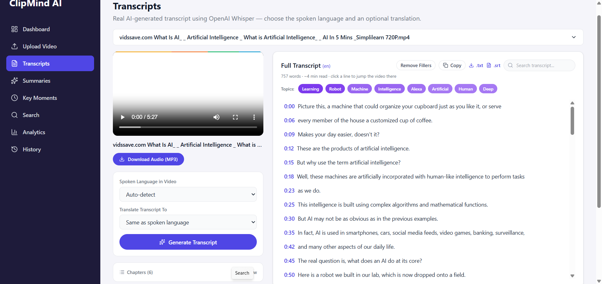
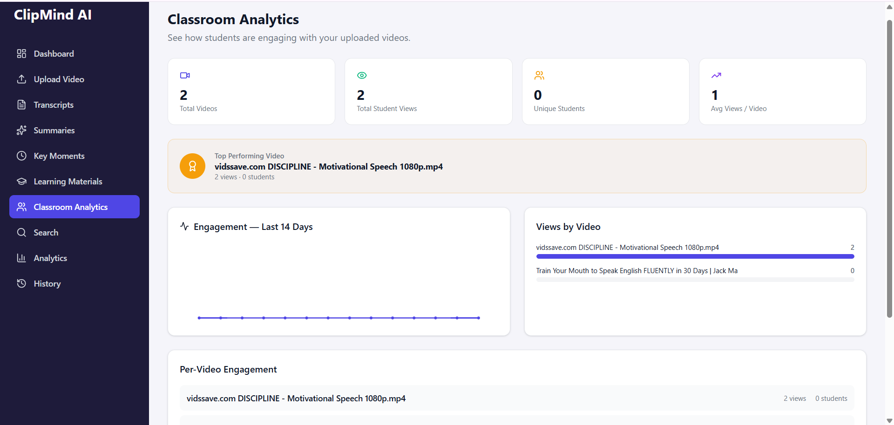
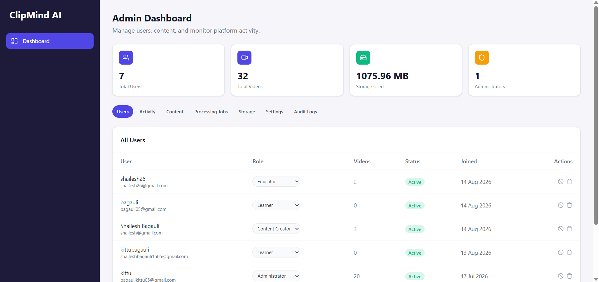

<div align="center">

# 🎬 ClipMind AI

### Turn long videos into clear insights, instantly.

**AI-powered transcripts, summaries, and key moments — built for creators, educators, and teams who don't have time to watch everything.**

[](https://www.python.org/)
[](https://fastapi.tiangolo.com/)
[](https://nextjs.org/)
[](https://www.postgresql.org/)
[](https://www.mongodb.com/)
[](https://github.com/openai/whisper)
[](./LICENSE)

</div>

---

## 📖 Overview

**ClipMind AI** is a full-stack, AI-powered video intelligence platform that automatically analyzes videos, extracts accurate transcripts, generates concise summaries, and detects the most important moments within any video — so users can consume long-form content in minutes instead of hours.

Built for **content creators, students, educators, media organizations, businesses, and online learning platforms**, ClipMind AI wraps real speech-to-text and NLP models in a clean, role-aware dashboard so every type of user — from someone uploading a lecture to someone just trying to learn from it — gets exactly the tools they need and nothing they don't.

> This isn't a demo with mocked data. Every transcript, summary, and key moment is generated by real AI models running against real uploaded video — Whisper for speech recognition, BART for summarization, all wired into a production-style FastAPI + Next.js stack.

---

## ✨ Why ClipMind AI Stands Out

| | |
|---|---|
| 🔐 **True Role-Based Access Control** | Not just a label in a database — every permission is enforced at the API level across 4 distinct roles |
| 🔗 **Upload from a link, not just a file** | Import videos directly from YouTube, Vimeo, or any direct video URL via `yt-dlp` |
| 🌐 **Public, trackable share links** | Educators can share a video's full package (video + summary + transcript + key moments) with a single link — no login required — with live view analytics |
| 🎓 **Auto-generated learning materials** | One click turns a summary into key points, quiz questions, and keywords for students |
| 📊 **Real classroom analytics** | Live engagement charts, top-performing content, and a 14-day trend graph — not static numbers |
| 🗂️ **Unified Video Detail view** | Transcript, summary, key moments, and learning materials for any video — all in one place, generated once and reused everywhere |
| 🌍 **Multi-language support** | Auto-detect spoken language and translate transcripts/summaries into 10+ languages |
| 🧠 **AI Chat, Q&A generation, sentiment & keyword extraction** | Goes beyond "summarize" into genuinely interactive content understanding |

---

## 👥 Roles & Permissions

ClipMind AI ships with four purpose-built roles, each with a distinct dashboard and its own enforced permission set on the backend.

### 🎨 Content Creator
> *Create and manage summarized content for audiences.*

- Upload videos (file or link)
- Generate transcripts, AI summaries, and key moments
- Download transcripts & summaries
- View personal content analytics and upload history

### 🎓 Learner
> *Consume educational and informational content efficiently.*

- Browse all videos uploaded by Creators & Educators (view-only, enforced with 403s on write actions)
- Read summaries, view transcripts, search within them
- Jump directly to key moments via timestamps
- Bookmark content and track personal learning history

### 👩‍🏫 Educator
> *Transform long educational content into concise learning resources.*

- Everything a Content Creator can do, plus:
- **Share** any video's full package via a public, view-tracked link
- **Auto-generate learning materials** — key points, quiz Q&A, keywords
- **Classroom Analytics** — views, unique students, engagement trend, top video, per-video breakdown

### 🛡️ Administrator
> *Maintain platform operations, security, and performance.*

- Manage users & roles (activate/deactivate, change role, delete)
- Monitor live platform activity and AI processing job status
- View **any** user's uploaded content platform-wide (read-only — content ownership stays with its creator)
- Track and manage storage usage by format and by top users
- Configure platform settings (upload limits, maintenance mode)
- Download full audit logs

---

## 🧩 Core Features

- 🎥 **Video Upload** — drag-and-drop file upload or import via URL, with format/size validation
- 📝 **Transcript Generation** — Whisper-powered speech-to-text with auto language detection, translation, filler-word cleanup, inline editing, and auto-generated chapters
- ✨ **AI Summarization** — short & detailed summaries, bullet-point view, one-click "make shorter," and auto-generated Q&A for self-testing
- 🎯 **Key Moments Detection** — automatic timestamp extraction and highlight reports
- 🔍 **Full-Text Search** — search inside any transcript, across the whole library
- 📊 **Analytics Dashboards** — personal, classroom-level, and platform-wide, all backed by real usage events
- 🔖 **Bookmarks & History** — save content for later, track everything you've done
- 🌓 **Dark Mode**, responsive UI, and Google OAuth login

---

## 🏗️ Architecture

```
                    ┌─────────────────────────────────────────┐
                    │         Next.js Frontend (React)         │
                    │   Role-aware dashboard · Auth · UI       │
                    └───────────────────┬───────────────────────┘
                                        │ REST / JWT
                    ┌───────────────────▼───────────────────────┐
                    │            FastAPI Backend                │
                    │  Auth · RBAC · Video/AI pipeline routes   │
                    └──────┬───────────────────────┬─────────────┘
                           │                       │
              ┌────────────▼──────────┐  ┌─────────▼─────────────┐
              │      PostgreSQL       │  │       MongoDB          │
              │ Users · Videos ·      │  │ Transcripts · Summaries│
              │ Analytics events      │  │ Key moments · Shares   │
              └────────────────────────┘  └─────────────────────────┘
                           │
              ┌────────────▼──────────────────────────────┐
              │         AI / Processing Pipeline           │
              │  Whisper (STT) · BART (summarization) ·    │
              │  FFmpeg (video/audio) · yt-dlp (URL import) │
              └─────────────────────────────────────────────┘
```

---

## 🛠️ Tech Stack

**Backend**
- Python · FastAPI · SQLAlchemy · Alembic
- PostgreSQL (relational: users, videos, analytics) · MongoDB (documents: transcripts, summaries, key moments, shares)
- JWT authentication · Google OAuth 2.0

**AI / ML**
- OpenAI Whisper (`faster-whisper`) — speech-to-text
- Hugging Face Transformers — BART summarization, Q&A generation
- `yt-dlp` — video import from URLs
- FFmpeg — video/audio processing, thumbnails

**Frontend**
- Next.js (App Router) · React · Tailwind CSS
- Lucide icons · Recharts-style custom SVG charts

**Tooling**
- Git & GitHub · Postman / Swagger (`/docs`) for API testing

---

## 📸 Screenshots

<div align="center">

**Landing Page**


**Dashboard**


**Transcripts & AI Summaries**


**Classroom Analytics (Educator)**


**Admin Dashboard**


</div>

---

## 🚀 Getting Started

### Prerequisites

- Python 3.11
- Node.js 18+
- PostgreSQL 14+
- MongoDB 6+

### 1. Clone the repository

```bash
git clone https://github.com/springboardmentor3010s/Clip-Mind-AI.git
cd Clip-Mind-AI
```

### 2. Backend setup

```bash
cd backend
python -m venv venv
venv\Scripts\activate        # Windows
# source venv/bin/activate   # macOS/Linux

pip install -r requirements.txt
pip install torch --index-url https://download.pytorch.org/whl/cpu

cp .env.example .env         # then fill in your DB credentials & secrets
```

Create the PostgreSQL database:

```sql
CREATE DATABASE clipmind_ai;
```

Run the server:

```bash
uvicorn app.main:app --reload
```

Backend runs at **http://localhost:8000** — interactive API docs at **http://localhost:8000/docs**

### 3. Frontend setup

```bash
cd frontend
npm install
npm run dev
```

Frontend runs at **http://localhost:3000**

### 4. You're in

Register an account, pick a role (Content Creator, Learner, Educator, or Administrator), and start uploading.

---

## 📁 Project Structure

```
clipmind-ai/
├── backend/
│   ├── app/
│   │   ├── api/v1/          # Route handlers (auth, videos, transcripts,
│   │   │                    #   summaries, keymoments, sharing, materials,
│   │   │                    #   bookmarks, analytics, admin)
│   │   ├── core/            # Config & security
│   │   ├── db/               # PostgreSQL & MongoDB connections
│   │   ├── models/           # SQLAlchemy models
│   │   ├── schemas/          # Pydantic schemas
│   │   └── services/         # AI pipeline (Whisper, BART, keywords, etc.)
│   └── requirements.txt
└── frontend/
    └── src/
        ├── app/               # Next.js App Router pages
        └── components/        # Dashboard, role-specific views, shared UI
```

---

## 🗺️ Development Roadmap

| Milestone | Focus | Status |
|---|---|---|
| 1 | Project setup, authentication, RBAC foundation, video upload | ✅ Complete |
| 2 | Transcript generation & AI summarization | ✅ Complete |
| 3 | Key moments detection & analytics dashboards | ✅ Complete |
| 4 | Testing, documentation & final delivery | ✅ Complete |

---

## 📄 License

This project is licensed under the MIT License — see [LICENSE](./LICENSE) for details.

---

<div align="center">

**Built with ❤️ for creators, educators, and lifelong learners.**

</div>
