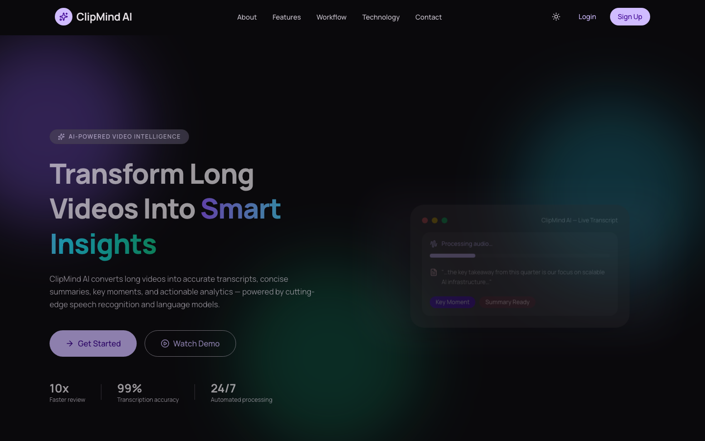
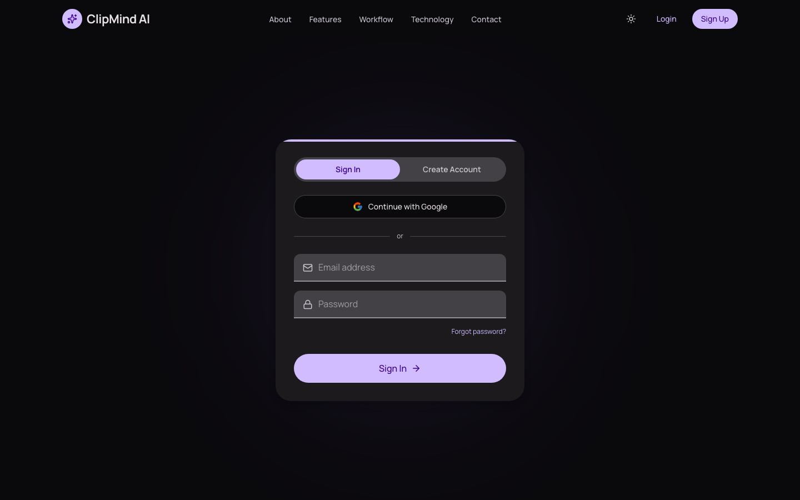
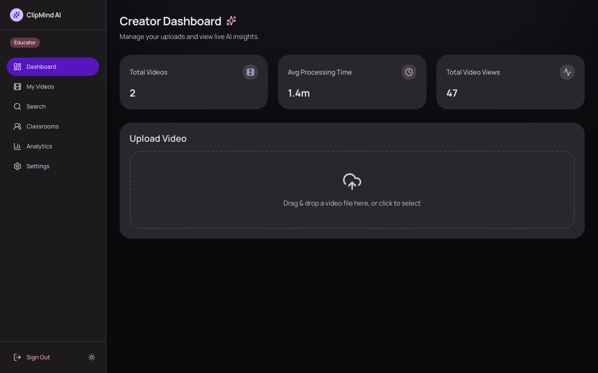
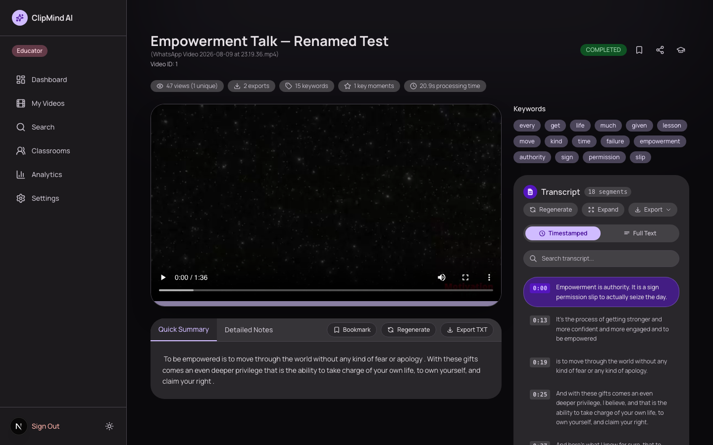
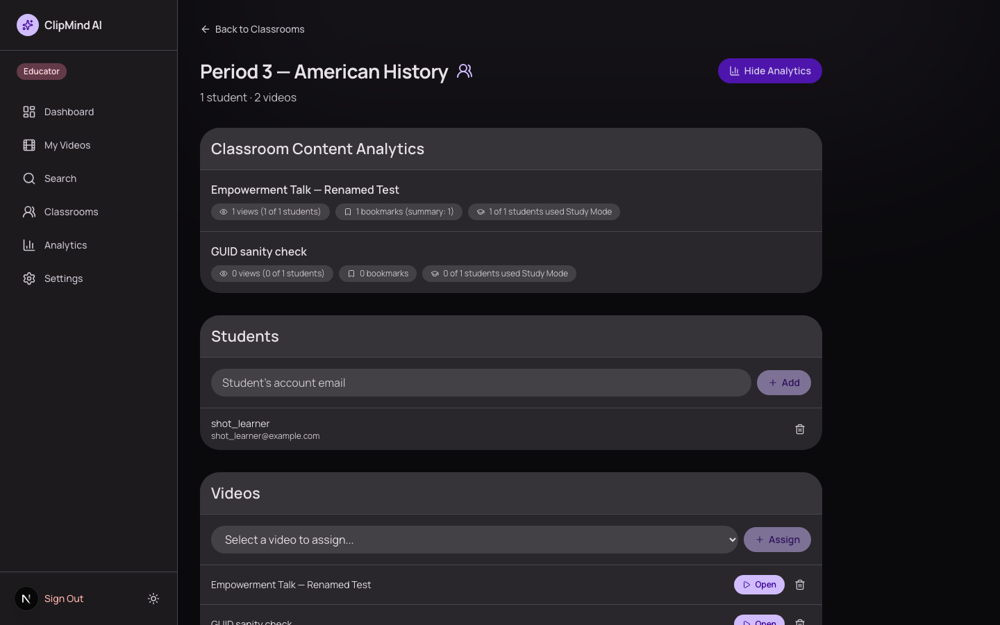
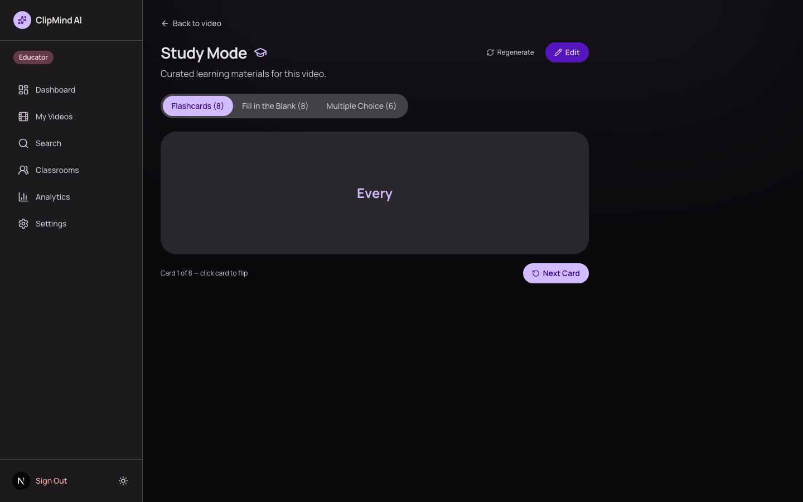
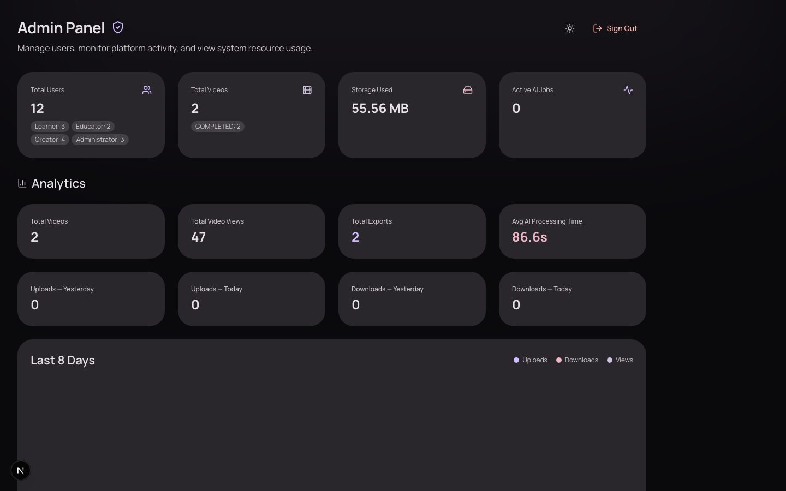

<div align="center">

# 🎬 ClipMind AI

### Turn long videos into transcripts, summaries, and study material — instantly.

**Real Whisper transcription and real summarization, wrapped in a role-aware platform for Creators, Educators, Learners, and Administrators.**

[](https://www.python.org/)
[](https://fastapi.tiangolo.com/)
[](https://nextjs.org/)
[](https://www.postgresql.org/)
[](https://redis.io/)
[](https://firebase.google.com/)
[](https://github.com/openai/whisper)
[](https://www.docker.com/)
[](./LICENSE)

</div>

---

## 📖 Overview

**ClipMind AI** is a full-stack AI video intelligence platform. Upload a
video and it's automatically transcribed, summarized, and broken into key
moments and keywords — turning something you'd otherwise have to sit through
into something you can skim, search, and study in minutes.

It's built around a real role-based access model — **Creator, Learner,
Educator, Administrator** — enforced server-side on every single endpoint,
not just hidden in the UI. An Educator can group Learners into a Classroom,
curate AI-generated study material for them, and see engagement scoped to
just that cohort. An Administrator gets real operational visibility —
processing jobs, storage, platform settings — not a handful of static
numbers.

> Every transcript, summary, and key moment is produced by real models
> running against the actual uploaded video — OpenAI Whisper for speech
> recognition, HuggingFace DistilBART for summarization, both running
> locally with no external AI API calls — wired into a FastAPI + Next.js
> stack, containerized with Docker.

---

## ✨ Why ClipMind AI Stands Out

| | |
|---|---|
| 🔐 **Real, enforced RBAC** | Every permission is checked server-side via a `require_role()` dependency on every endpoint — hiding a sidebar link isn't the security boundary |
| 🎯 **Bookmark more than "the video"** | Bookmark the whole video, a specific summary, or a single highlight — not just one blunt "save" button |
| 🎓 **Classrooms** | Educators group Learners by email, assign specific videos, and see engagement analytics scoped to just that cohort — not their entire catalog |
| 🧠 **Curated Study Mode** | Flashcards / fill-in-the-blank / MCQs are auto-generated from the transcript, then editable and persisted by the Educator — not regenerated from scratch on every view |
| 🛡️ **A real Admin Panel** | Live processing-job status, a size-sorted storage view with delete-to-free-space, and platform settings (maintenance mode, registration toggle, upload limits) that are actually enforced, not cosmetic |
| 🔑 **Firebase Authentication** | Email/password and Google sign-in, with self-service password reset — the backend never touches a password, only a verified identity token |
| 🔗 **Shareable read-only links** | Share a video's summary publicly with a single link, no login required for the viewer |
| 💸 **No per-request AI cost** | Whisper and DistilBART run locally in the backend — no external API calls, no usage-based billing |

---

## 👥 Roles & Permissions

Four roles, each with its own dashboard and its own server-enforced
permission set — **Administrator always passes every role check**, on top
of its own dedicated panel.

### 🎨 Creator
> *Upload and manage AI-processed video content.*
- Upload videos, generate/regenerate transcripts, summaries, and key moments
- Edit transcripts and summaries, export as `.txt`/`.srt`
- View personal upload history and per-video analytics

### 🎓 Learner
> *Consume and study content efficiently.*
- Browse videos, read summaries, search across every transcript
- Jump straight to a key moment via its timestamp
- Bookmark a video, a summary, or a single highlight
- Study Mode — flashcards, fill-in-the-blank, MCQs — for any assigned video
- Join Classrooms an Educator has added them to

### 👩‍🏫 Educator
> *Everything a Creator can do, plus curating content for a cohort.*
- Create Classrooms, add Learners by email, assign specific videos
- View classroom-scoped engagement analytics — views, unique viewers,
  bookmarks, Study Mode participation — filtered to just that cohort
- Edit and save Study Mode content as the version students actually see
- Generate a public, read-only share link for any video

### 🛡️ Administrator
> *Operate the platform.*
- Manage users and roles
- Platform-wide analytics (merged directly into the Admin Panel — no
  separate tab to dig through)
- Live AI processing-job status — in-flight and recently completed
- Storage management — size-sorted, with a one-click delete to free space
- Enforced platform settings — maintenance mode, registration toggle,
  max upload size
- Audit log of sensitive actions (e.g. role changes)

---

## 🧩 Core Features

- 🎥 **Video Upload** — multipart upload straight to Cloudflare R2 object storage
- 📝 **Transcript Generation** — Whisper-powered speech-to-text with timestamped segments, inline editing, full-text/timestamped views, and `.txt`/`.srt` export
- ✨ **AI Summarization** — Quick and Detailed summaries via DistilBART, editable, exportable
- 🎯 **Key Moments Detection** — extractive, keyword-density chaptering with exportable highlight reports
- 🔍 **Full-Text Search** — search inside every transcript across the whole library, with timestamp context
- 📊 **Analytics** — personal, classroom-scoped, and platform-wide, all backed by real usage events, not sampled/estimated data
- 🔖 **Bookmarks & History** — granular bookmarking plus a full activity history
- 🌓 **Material 3 Expressive design system** — full light/dark theming, generated from a single brand seed color

---

## 🏗️ Architecture

```
                    ┌─────────────────────────────────────────┐
                    │      Next.js Frontend (React, App Router) │
                    │  Role-aware dashboard · Material 3 UI     │
                    └───────────────────┬─────────────────────┬─┘
                                        │ REST (JWT)           │ Firebase Auth SDK
                    ┌───────────────────▼───────────────────┐  │ (email/password, Google)
                    │             FastAPI Backend             │  │
                    │  require_role() RBAC · video/AI routes  │◄─┘  verified ID token
                    └──────┬───────────────┬──────────────────┘
                           │               │
              ┌────────────▼─────┐  ┌──────▼───────────┐
              │    PostgreSQL     │  │       Redis        │
              │ Users · Videos ·  │  │ Optional response   │
              │ Classrooms ·      │  │ cache — app runs     │
              │ Analytics events  │  │ fine without it       │
              └───────────────────┘  └───────────────────────┘
                           │
              ┌────────────▼──────────────────────────────┐
              │         AI / Processing Pipeline           │
              │  Whisper (speech-to-text) · DistilBART      │
              │  (summarization) · rake-nltk (keywords) ·    │
              │  FFmpeg (audio extraction) · Cloudflare R2   │
              │  (video object storage)                       │
              └─────────────────────────────────────────────┘
```

Full reasoning behind each decision, and how every piece connects, is in
[`docs/ARCHITECTURE.md`](./docs/ARCHITECTURE.md).

---

## 🛠️ Tech Stack

**Backend**
- Python · FastAPI · SQLAlchemy ORM
- PostgreSQL — the only database; no Alembic — schema changes ship via
  `Base.metadata.create_all()` plus a self-healing `ensure_column()` helper
- JWT session tokens (`python-jose`) · Firebase Authentication, verified
  server-side via `google-auth` (no service-account secret needed)
- Redis — optional response cache, resilient no-op if unavailable

**AI / ML** — all running locally, no external API calls
- OpenAI Whisper (via `transformers`) — speech-to-text
- HuggingFace DistilBART — summarization
- `rake-nltk` — keyword extraction / extractive key-moment chaptering
- FFmpeg — audio extraction from uploaded video

**Frontend**
- Next.js (App Router) · React · Tailwind CSS v4
- Hand-built Material 3 Expressive design system (full light/dark theming)
- Firebase client SDK (email/password + Google sign-in, password reset)
- Framer Motion, Recharts-style custom SVG charts

**Infrastructure**
- Cloudflare R2 (S3-compatible) — video object storage, multipart upload
- Docker + Docker Compose — the whole stack (Postgres, Redis, backend,
  frontend) in one command

## 📚 Documentation

- **In-depth architecture** (data flow, RBAC, deployment topology): [`docs/ARCHITECTURE.md`](./docs/ARCHITECTURE.md)
- **Backend implementation & API reference**: [`docs/BACKEND.md`](./docs/BACKEND.md) (or the live, always-current Swagger UI at `http://localhost:8000/docs` once the backend is running)
- **Frontend implementation details**: [`docs/FRONTEND.md`](./docs/FRONTEND.md)

## 🔑 Authentication

Firebase owns the credential (password storage, reset emails, Google OAuth);
the backend only ever sees a verified Firebase ID token, exchanges it for
its own short-lived session JWT, and is the source of truth for **role**
(Creator/Learner/Educator/Administrator lives in Postgres, not Firebase).
Forgot password is handled entirely by Firebase's built-in reset-email flow
— no backend involvement.

The Firebase web config in `frontend/src/lib/firebase.ts` has working
defaults baked in (Firebase web config values aren't secret — see
[`frontend/.env.example`](./frontend/.env.example) if you need to point at a
different Firebase project). The backend needs `FIREBASE_PROJECT_ID` to
match (see `backend/.env.example`) so it can verify tokens against the
right project.

**Administrator accounts can't self-register** (by design — see
`SELF_REGISTERABLE_ROLES` in `backend/app/services/auth_service.py`).
Bootstrap the first admin by registering normally, then promoting the row
directly:

```bash
psql "$DATABASE_URL" -c "
UPDATE users SET role_id = (SELECT id FROM roles WHERE name = 'Administrator')
WHERE email = 'your-admin-email@example.com';
"
```

---

## 📸 Screenshots

<div align="center">

**Landing Page**


**Sign In / Create Account**


**Dashboard**


**Video Detail — Transcript, Summary & Key Moments**


**Classrooms & Cohort Analytics**


**Study Mode**


**Admin Panel**


</div>

---

## 🚀 Getting Started

### Option A — Docker (recommended, no local Python/Node setup)

1. Create a `.env` file in the repo root with your Cloudflare R2 credentials
   (see `backend/.env.example` for the full list).
2. ```bash
   docker compose up --build -d
   ```
3. Visit `http://localhost:3000` (frontend) and `http://localhost:8000/docs`
   (backend API docs).
4. `docker compose logs -f` to tail logs, `docker compose down` to stop
   (keeps the Postgres volume — data survives), `docker compose down -v` to
   also wipe it.

If port `5432` is already in use locally, remap just the `db` service in
`docker-compose.yml` (e.g. `"5433:5432"`) — that's host-only and doesn't
affect container-to-container networking or your data.

### Option B — Manual (Python + Node)

**Prerequisites:** PostgreSQL running locally, FFmpeg installed (`brew
install ffmpeg` / `sudo apt install ffmpeg` / see `backend/.env.example` for
Windows options).

```bash
# Database
psql -U postgres -c "CREATE DATABASE clipmind;"

# Backend
cd backend
python -m venv venv
source venv/bin/activate        # Windows: venv\Scripts\activate
pip install -r requirements.txt
cp .env.example .env            # fill in R2 credentials
uvicorn app.main:app --reload --port 8000

# Frontend (new terminal)
cd frontend
npm install
npm run dev
```

Open `http://localhost:3000`, register an account, pick a role, and start
uploading.

## ✅ Running the test suites

```bash
# Backend — hermetic, in-memory SQLite, no external services required
cd backend && venv/bin/pytest tests/ -v

# Frontend
cd frontend && npm test
```

CI (`.github/workflows/`) runs both automatically on every push/PR touching
`backend/` or `frontend/`.

## ☁️ Deploying

The project ships as two Docker images (backend, frontend) plus Postgres
and Redis, orchestrated by `docker-compose.yml` — that's the deployment
unit for any Docker-capable host (a VM, a bare-metal box, etc):

1. Copy the repo (or just `docker-compose.yml` + the `backend`/`frontend`
   directories) to the target host.
2. Provide the same `.env` (R2 credentials, `SECRET_KEY`, `FIREBASE_PROJECT_ID`)
   at the repo root — **never commit this file**; `backend/.env` and root
   `.env` are both gitignored for exactly this reason.
3. **If the frontend will be reached at anything other than `localhost`**
   (a VM's public IP, a real domain), set two more things in that same
   `.env` — both are baked in at build time / read at request time, not
   something you can fix by editing config after the containers are up:
   ```bash
   NEXT_PUBLIC_API_URL=http://<your-public-ip-or-domain>:8000
   EXTRA_CORS_ORIGINS=http://<your-public-ip-or-domain>:3000
   ```
   Without these, the frontend's JS keeps calling `localhost:8000` (which
   means *the visitor's own machine*, not your server) and/or the backend
   rejects the request as a CORS violation.
4. ```bash
   docker compose up --build -d
   ```
5. Point a reverse proxy (nginx, Caddy, Traefik, etc.) at ports `3000`
   (frontend) and `8000` (backend) for TLS termination and a real domain —
   `docker-compose.yml` itself doesn't handle HTTPS.
6. The backend downloads/loads Whisper + DistilBART model weights on first
   boot, which can take several minutes — this is expected, not a hang.

**Updating an existing deployment without touching data:**

```bash
git pull origin <branch>
docker compose up --build -d
```

This rebuilds only the images whose source changed and recreates those
containers — the `db`/`redis` containers and their volumes are left alone
unless you explicitly run `docker compose down -v`. Never run the `-v`
variant on a deployment you want to keep the database for.

---

## 📁 Project Structure

```
clipmind-ai/
├── backend/
│   ├── app/
│   │   ├── api/          # One FastAPI router per feature area — auth, upload,
│   │   │                 #   transcript, summary, key_moments, learn, bookmarks,
│   │   │                 #   classrooms, search, share, users, admin, analytics
│   │   ├── core/         # Config, DB session, JWT + Firebase-token verification,
│   │   │                 #   require_role()/RBAC dependencies, Redis cache wrapper
│   │   ├── models/       # SQLAlchemy models — one per table
│   │   ├── schemas/      # Pydantic request/response models
│   │   └── services/     # Business logic — auth, transcription, summarization,
│   │                     #   key-moment/keyword extraction, R2 storage
│   ├── tests/            # Hermetic pytest suite (in-memory SQLite)
│   └── requirements.txt
├── frontend/
│   └── src/
│       ├── app/           # Next.js App Router — marketing site + dashboard
│       ├── components/    # UI primitives, video viewers, auth, dashboard chrome
│       ├── context/        # Auth state
│       ├── lib/             # Firebase client, authenticated fetch wrapper
│       └── services/         # API clients
├── docs/                  # Architecture, backend, and frontend deep-dives
└── docker-compose.yml     # Postgres + Redis + backend + frontend, one command
```

---

## 🗺️ Development Roadmap

| Milestone | Focus | Status |
|---|---|---|
| 1 | Project setup, JWT auth, video upload to Cloudflare R2 | ✅ Complete |
| 2 | Whisper transcription & DistilBART summarization | ✅ Complete |
| 3 | Key moments detection, full-text search, analytics dashboard | ✅ Complete |
| 4 | Role-based access control, Classrooms, Study Mode, granular bookmarking, Admin Panel, Firebase Authentication, Docker deployment, automated tests & documentation | ✅ Complete |

---

## 📄 License

This project is licensed under the **Apache License 2.0** — see [`LICENSE`](./LICENSE) for the full text.

---

<div align="center">

**Built for creators, educators, and lifelong learners.**

</div>
