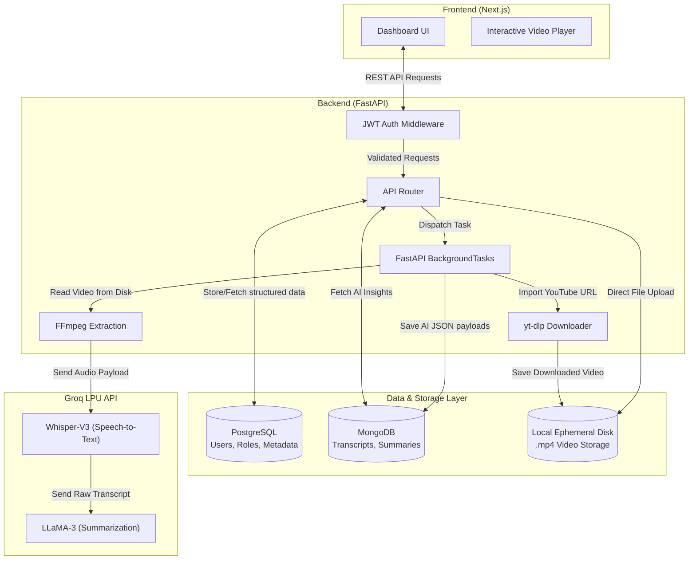

# ClipMind AI: Video Summarization & Key Moments Detection Platform

[](https://clipmind-ai-frontend.onrender.com/)
[](https://clipmind-ai-8hkx.onrender.com/docs)

An AI-powered video summarization platform that automatically analyzes videos, extracts transcripts, generates concise summaries, and identifies important moments within video content.

## Live Demo
- **Frontend (Web App):** [https://clipmind-ai-frontend.onrender.com/](https://clipmind-ai-frontend.onrender.com/)
- **Backend docs (API Base):** [https://clipmind-ai-8hkx.onrender.com/](https://clipmind-ai-8hkx.onrender.com/docs)

<!-- 
NOTE FOR EVALUATORS: 
While the application is fully containerized and deployed to Render, we highly recommend running the local development environment for live demonstrations. 
Free-tier cloud instances suffer from ephemeral storage wipes (breaking video playback on server sleep), datacenter IP blocking by YouTube (breaking URL imports), and severe cold start timeouts. 
The local environment accurately reflects the true capabilities and performance of the platform. 
Please refer to `documentation/Cloud_Constraints.md` for a full technical breakdown of these limitations.
-->

---

## Project Documentation

All detailed documentation regarding architecture, milestones, API endpoints, and deployment can be found in the `documentation/` directory:

1. **[Project Milestones](./documentation/Milestones.md)** — Detailed breakdown of what was achieved across all 4 milestones.
2. **[Tech Stack](./documentation/Tech_Stack.md)** — Overview of the technologies, frameworks, and AI models utilized.
3. **[Deployment Guide](./documentation/Deployment.md)** — Information on our Docker containerization and Render cloud hosting strategy.
4. **[API Documentation](./documentation/API_Docs.md)** — Guide to the FastAPI backend endpoints (Auth, Video, AI Processing, Analytics).

## System Architecture



---

## Features

- **Role-Based Access:** Tailored dashboards for Content Creators, Educators, Learners, and Administrators.
- **Intelligent Processing:** Fast and accurate Speech-to-Text utilizing advanced NLP models (Groq LPU / Whisper).
- **AI Generation:** Automatic generation of:
  - Transcripts
  - Brief and Detailed Summaries
  - Key Moments with clickable timestamps
  - Quizzes and Study Guides for Educators
- **Analytics Dashboard:** Real-time metrics and trending keyword extraction.

---

## Quick Start (Local Development)

If you wish to run the project locally using Docker Compose:

1. Clone this repository:
   ```bash
   git clone https://github.com/devanshi14malhotra/ClipMind-AI.git
   cd ClipMind-AI
   ```
2. Create a `.env` file in the `backend/` directory based on `.env.example` containing your API keys (Groq, Postgres, MongoDB).

3. **Run the Backend:**
   Open a terminal and start the FastAPI server:
   ```bash
   cd backend
   # Activate your virtual environment (if using one)
   pip install -r requirements.txt
   uvicorn main:app --reload
   ```

4. **Run the Frontend:**
   Open a new terminal and start the Next.js development server:
   ```bash
   cd frontend
   npm install
   npm run dev
   ```

5. Access the frontend at `http://localhost:3000` and backend at `http://localhost:8000`.
